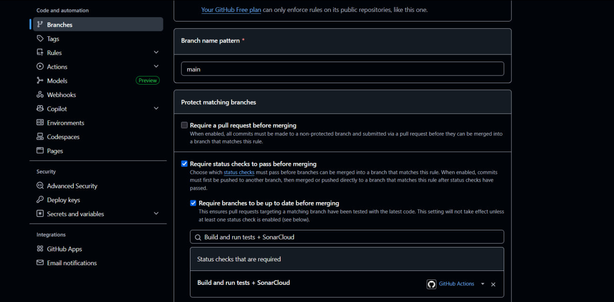
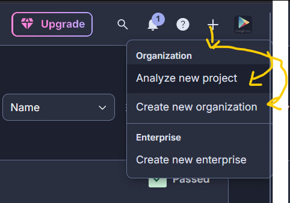
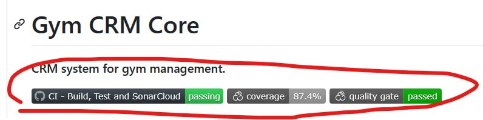

# Sonarcube actions example

## Prerequisites

- **Java Development Kit (JDK) 17 or higher**
- **Maven**
- **Git**

## Setup Instructions

### Set up github actions
1. Add file with following path /github/workflows/ci.yml your project


2. Configure file with code https://github.com/borderForNoone/gym-crm/blob/feature/GIA-77/.github/workflows/ci.yml#L1-L30


3. Go to "Settings" in your github repository and choose "Branches"


4. Add rule : paste develop branch for "Branch name pattern" and toggle buttons as in screenshot
   


5. Add check with name "Build and run tests + SonarCloud"(will be appeared when file will be merged or in MR)


### Set up Sonarcube
1. Register sonar cloud account with github. Link: https://sonarcloud.io/login


2. Create your organization with your github


3. Analyze your new project
   


4. Go to your project in sonar cloud click "Adminisration" and choose "Analysis Method" and turn off Automtic Analysis


5. Go to "My Account" and choose "Security"


6. Give any name to your token and generate it


7. After generation copy hashed token and save somewhere


8. Go to "Settings" in your github repository and choose "Secrets and variables" -> Actions


9. Create new secret


10. Type SONAR_TOKEN for name and type hashed token from sonar in secret which we get from step 6


11. Build plugins https://github.com/borderdornone/gym-crm/blob/develop/pom.xml#L98-L126


12. Add your properties https://github.com/borderdornone/gym-crm/blob/develop/pom.xml#L15-L17


13. Add config https://github.com/borderdornone/gym-crm/blob/develop/.github/workflows/ci.yml#L31-L39


14. To obtain code coverage badge: Insert to README.md next three line (update links with your SonarQube project id)
    
    Please add to top of README.md:
```

[](https://sonarcloud.io/summary/overall?id=<SONAR_PROJECT_ID>)
[](https://sonarcloud.io/summary/overall?id=<SONAR_PROJECT_ID>)
```
Where:
CI_PATH - path for your CI yml file
SONAR_PROJECT_ID = project id from https://sonarcloud.io

Example for this repo:
CI_PATH = https://github.com/borderForNoone/gym-crm/actions/workflows/ci.yml
SONAR_PROJECT_ID = borderForNoone_gym-crm
```

[](https://sonarcloud.io/summary/overall?id=borderForNoone_gym-crm)
[](https://sonarcloud.io/summary/overall?id=borderForNoone_gym-crm)
```


15. Push changes to github and check if it works